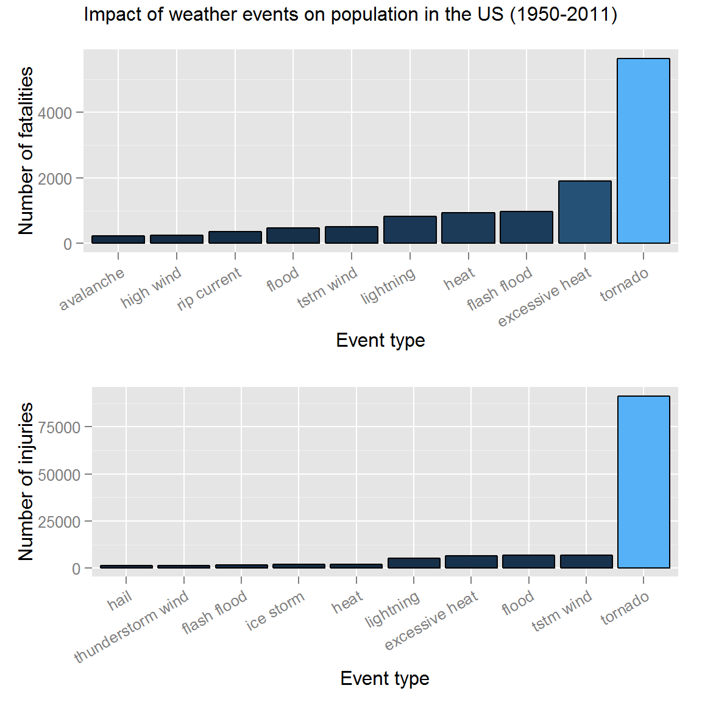

Impact of severe weather events in the US on public health and the economy
==========================================================================

This is a R Markdown document for Coursera's Reproducible Research
course project 2.

Synopsis
--------

We explored the NOAA Storm Database in an effort to answer some basic
questions about severe weather events and its impact in the US. The
events in the database start in the year 1950 and end in November 2011.

Specifically, we address the following:  
1. Impact on public health - severe weather events can result in
injuries or worse, fatalities  
 + The analysis revealed that tornados are the most dangerous events to
the population on both accounts 2. Impact on the economy - we will
ascertain the economic losses incurred in terms of damages to property
and crops  
 + Flash floods caused billions of dollars in property damages, nearly 3
times as much as thunderstorm winds + Crop damages between 1950 and 2011
were caused mainly by droughts, followed by floods

Data processing
---------------

Set the working directory.

    setwd("~/Coursera_R/05_reprodicbleResearch/courseProject2")
    getwd()

    ## [1] "C:/Users/Srivatsan/Documents/Coursera_R/05_reprodicbleResearch/courseProject2"

Download the file (if unavailable) and unzip it.

    if (!"repdata-data-StormData.csv.bz2" %in% dir("./")) {
        download.file("http://d396qusza40orc.cloudfront.net/repdata%2Fdata%2FStormData.csv.bz2", destfile = "repdata-data-StormData.csv.bz2")
        bunzip2("repdata-data-StormData.csv.bz2", overwrite = T, remove = F)
    }

Read the CSV file, check the dimensions of the dataset.

    if (! exists("storm") ) {
        storm <- read.csv(bzfile("repdata-data-StormData.csv.bz2"))
    }
    dim(storm)

    ## [1] 902297     37

This database is quite sizeable and occupies:

    ## 409.4 Mb

Reduce the dataset based on columns that are necessary for the analysis.

    length(unique(storm$EVTYPE))

    ## [1] 985

    # Force letters to lowercase
    event_types <- tolower(storm$EVTYPE)
    length(unique(event_types))

    ## [1] 898

    # Replace non-alphanumeric by a space
    event_types <- gsub("[^[:alnum:][:space:]]", " ", event_types)
    length(unique(event_types))

    ## [1] 874

    # Update EVTYPE in the dataframe
    storm$EVTYPE <- event_types

    # Reduce dataframe to only necessary columns
    keepCols <- c("BGN_DATE", "EVTYPE", "FATALITIES", "INJURIES", 
                  "PROPDMG", "PROPDMGEXP", "CROPDMG", "CROPDMGEXP")
    stormData <- storm[, keepCols]

As expected, after the cleaning we see a reduction in the number of
unique event types (from *985* to *874*). We proceed further with our
analysis using this updated list of `EVTYPE`.

Impact on public health
-----------------------

We take a closer look at the number of casualities resulting from severe
weather events. In particular, we aggregate two types of data:
`FATALITIES` and `INJURIES`.

    library(dplyr)  # for %>%

    ## Warning: package 'dplyr' was built under R version 3.2.3

    ## 
    ## Attaching package: 'dplyr'
    ## 
    ## The following objects are masked from 'package:stats':
    ## 
    ##     filter, lag
    ## 
    ## The following objects are masked from 'package:base':
    ## 
    ##     intersect, setdiff, setequal, union

    fatalities <- aggregate(FATALITIES ~ EVTYPE, data = stormData, sum)
    injuries <- aggregate(INJURIES ~ EVTYPE, data = stormData, sum)

    # Get the top 10 list
    top10Fatal <- fatalities %>% arrange(desc(FATALITIES)) %>% top_n(10)

    ## Selecting by FATALITIES

    top10Fatal

    ##            EVTYPE FATALITIES
    ## 1         tornado       5633
    ## 2  excessive heat       1903
    ## 3     flash flood        978
    ## 4            heat        937
    ## 5       lightning        816
    ## 6       tstm wind        504
    ## 7           flood        470
    ## 8     rip current        368
    ## 9       high wind        248
    ## 10      avalanche        224

Clearly, tornados caused the most damage to lives, accounting for
**5633** deaths.

    top10Injury <- injuries %>% arrange(desc(INJURIES)) %>% top_n(10)

    ## Selecting by INJURIES

    top10Injury

    ##               EVTYPE INJURIES
    ## 1            tornado    91346
    ## 2          tstm wind     6957
    ## 3              flood     6789
    ## 4     excessive heat     6525
    ## 5          lightning     5230
    ## 6               heat     2100
    ## 7          ice storm     1975
    ## 8        flash flood     1777
    ## 9  thunderstorm wind     1488
    ## 10              hail     1361

Tornados also caused injuries to a further **91346** people.  
Note, the `EVTYPE` field can be processed further to merge event types
such as `tstm wind` and `thunderstorm wind`.

Impact on the economy
---------------------

In the raw data, we see that property damage is represented as two
fields, a `PROPDMG` value and a `PROPDMGEXP` exponent. Similarly, crop
damage is represented as two fields, a `CROPDMG` value and a
`CROPDMGEXP` exponent.

In order to analyse the impact of weather events to the economy, we will
convert the property damage and crop damage data into numerical forms
using definitions in [Storm Data
Documentation](https://d396qusza40orc.cloudfront.net/repdata%2Fpeer2_doc%2Fpd01016005curr.pdf).

Let's take a look at the exponent columns.

    # Number of unique exponents
    levels(unique(stormData$PROPDMGEXP))

    ##  [1] ""  "-" "?" "+" "0" "1" "2" "3" "4" "5" "6" "7" "8" "B" "h" "H" "K"
    ## [18] "m" "M"

    levels(unique(stormData$CROPDMGEXP))

    ## [1] ""  "?" "0" "2" "B" "k" "K" "m" "M"

First, we use a helper function to translate the exponent into numeric
type.

    # Convert the exponent into numeric
    get_exponent <- function(x) {
        # h -> hundred, k -> thousand, m -> million, b -> billion
        if(grepl("h", x, ignore.case = TRUE)) {
            return(2)
        }
        else if(grepl("k", x, ignore.case = TRUE)) {
            return(3)
        }
        else if(grepl("m", x, ignore.case = TRUE)) {
            return(6)
        }
        else if(grepl("b", x, ignore.case = TRUE)) {
            return(9)
        }
        else if(x %in% c('', ' ', '?', '+')) {
            return(0)
        }
        else if (!is.na(as.numeric(x))) {
            return(as.numeric(x))
        }
        else {
            stop("Invalid exponent value.")
        }
    }

Second, we calculate the property and crop damage for each event.

    # Add columns to facilitate computation of the damages
    prop_dmg_exp <- sapply(stormData$PROPDMGEXP, FUN = get_exponent)
    crop_dmg_exp <- sapply(stormData$CROPDMGEXP, FUN = get_exponent)
    stormData$propDamage <- stormData$PROPDMG * (10 ** prop_dmg_exp)
    stormData$cropDamage <- stormData$CROPDMG * (10 ** crop_dmg_exp)

    prop_dmg <- aggregate(propDamage ~ EVTYPE, data = stormData, sum)
    top10Prop_Damage <- prop_dmg %>% arrange(desc(propDamage)) %>% top_n(10)

    ## Selecting by propDamage

    top10Prop_Damage

    ##                EVTYPE   propDamage
    ## 1         flash flood 6.820237e+13
    ## 2  thunderstorm winds 2.086532e+13
    ## 3             tornado 1.078951e+12
    ## 4                hail 3.157558e+11
    ## 5           lightning 1.729433e+11
    ## 6               flood 1.446577e+11
    ## 7   hurricane typhoon 6.930584e+10
    ## 8            flooding 5.920825e+10
    ## 9         storm surge 4.332354e+10
    ## 10         heavy snow 1.793259e+10

    crop_dmg <- aggregate(cropDamage ~ EVTYPE, data = stormData, sum)
    top10Crop_Damage <- crop_dmg %>% arrange(desc(cropDamage)) %>% top_n(10)

    ## Selecting by cropDamage

    top10Crop_Damage

    ##               EVTYPE  cropDamage
    ## 1            drought 13972566000
    ## 2              flood  5661968450
    ## 3        river flood  5029459000
    ## 4          ice storm  5022113500
    ## 5               hail  3025974453
    ## 6          hurricane  2741910000
    ## 7  hurricane typhoon  2607872800
    ## 8        flash flood  1421317100
    ## 9       extreme cold  1312973000
    ## 10      frost freeze  1094186000

Results
-------

### Health impact of weather events

Here's a plot showing the most harmful weather events to the population
health:

    library(ggplot2)
    library(gridExtra)

    ## Warning: package 'gridExtra' was built under R version 3.2.3

    # Fatalities plot
    gg1 <- ggplot(data=top10Fatal,
                  aes(x=reorder(EVTYPE, FATALITIES), y=FATALITIES, fill=FATALITIES)) +
        geom_bar(stat="identity", color = "black") +
        xlab("Event type") +
        ylab("Number of fatalities") +
        theme(legend.position="none") +
        theme(axis.text.x = element_text(angle = 30, hjust = 1))

    # Injuries plot
    gg2 <- ggplot(data=top10Injury,
                  aes(x=reorder(EVTYPE, INJURIES), y=INJURIES, fill=INJURIES)) +
        geom_bar(stat="identity", color = "black") +
        xlab("Event type") +
        ylab("Number of injuries") +
        theme(legend.position="none") +
        theme(axis.text.x = element_text(angle = 30, hjust = 1))

    # Some argnames have changed for grid.arrange. Use `main` instead of `top`
    grid.arrange(gg1, gg2, top = "Impact of weather events on population in the US (1950-2011)")

**Tornados** caused the most damage to lives, accounting for more than
**5,000** deaths, **90,000** injuries. **Flash floods** and **excessive heat**
also resulted in significant causalities.

### Economic impact of weather events

Here's a plot showing the economic impact of severe weather events in
the US between 1950-2011:

    library(ggplot2)
    library(gridExtra)

    # Property damages plot
    gg3 <- ggplot(data=top10Prop_Damage,
                  aes(x=reorder(EVTYPE, propDamage), y=log10(propDamage), fill=propDamage)) +
        geom_bar(stat="identity", color = "black") +
        xlab("Event type") +
        ylab("Property damages in USD (log-scale)") +
        theme(legend.position="none") +
        theme(axis.text.x = element_text(angle = 30, hjust = 1))

    # Crop damages plot
    gg4 <- ggplot(data=top10Crop_Damage,
                  aes(x=reorder(EVTYPE, cropDamage), y=log10(cropDamage), fill=cropDamage)) +
        geom_bar(stat="identity", color = "black") +
        xlab("Event type") +
        ylab("Crop damages in USD (log-scale)") +
        theme(legend.position="none") +
        theme(axis.text.x = element_text(angle = 30, hjust = 1))

    # Some argnames have changed for grid.arrange. Use `main` instead of `top`
    grid.arrange(gg3, gg4, top = "Impact of weather events on the US economy (1950-2011)")

Owing to large-scale losses incurred, property and crop damages are
represented in *logarithmic* scale.  
**Flash floods** and **thunderstorm winds** caused the most damage to property,
running into **few trillion** dollars.  
**Droughts** have cost more than **10 billion dollars** in crop damages. **Floods**
and **hails** also posed significant threat to crops during the last 60
years.
